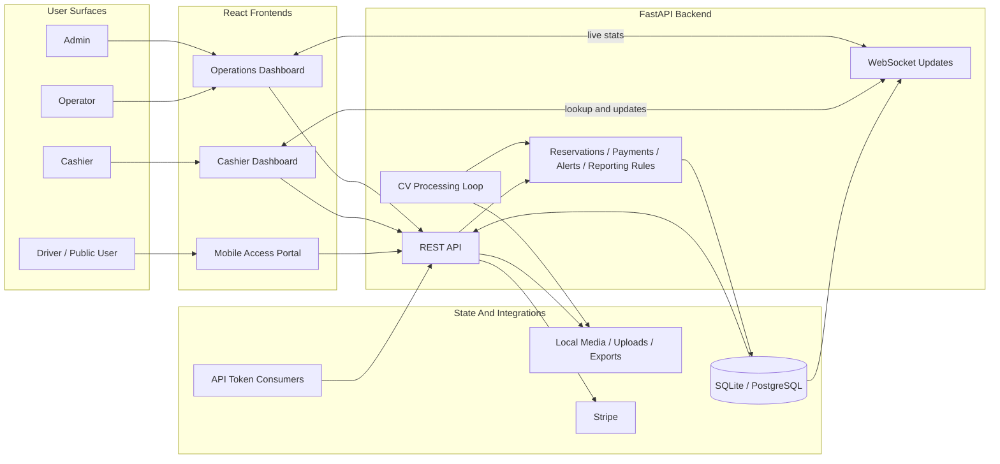
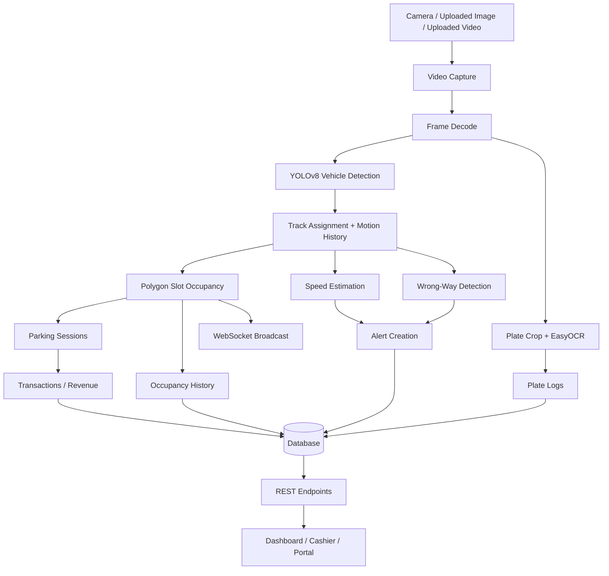
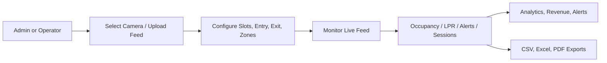
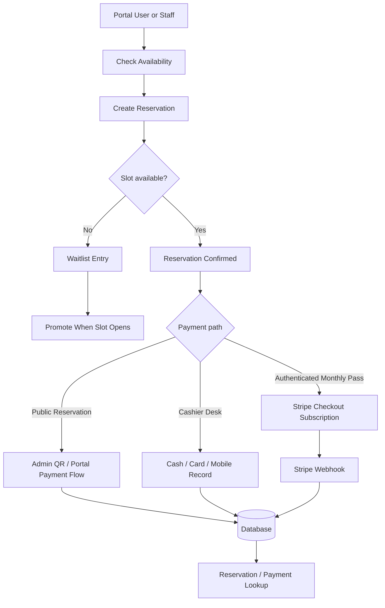
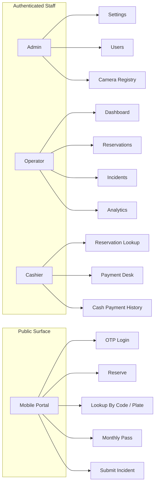
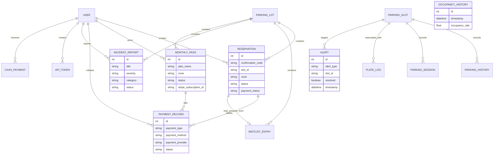
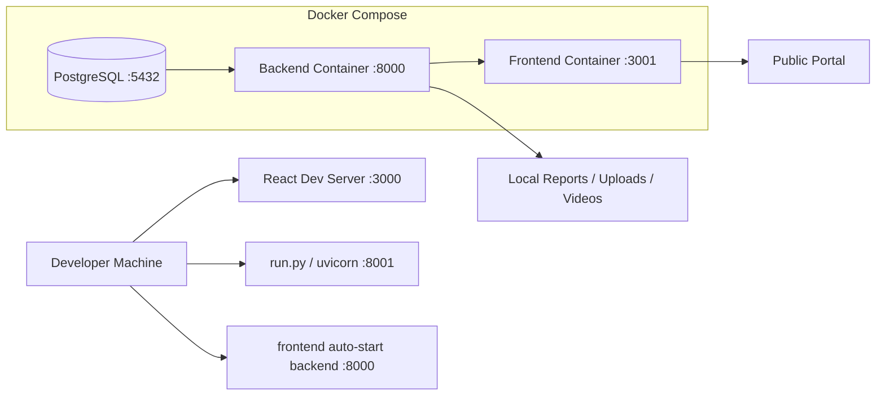

# Smart Parking Platform

Smart Parking is a full-stack parking operations platform built with FastAPI, React, OpenCV, YOLOv8, and EasyOCR. It combines computer vision, parking operations, reservations, cashier workflows, payments, reporting, and a public mobile access portal in a single codebase.

The project already supports:

- live webcam and uploaded-feed monitoring
- polygon-based slot editing with entry and exit zones
- real-time occupancy tracking and WebSocket updates
- license plate recognition, speed alerts, wrong-way detection, and abandoned-vehicle alerts
- reservations, waitlists, incidents, monthly passes, cashier payments, and revenue reporting
- admin settings, user management, API tokens, exports, and a public mobile portal

## Platform Overview



## Runtime Architecture



## Key Product Flows

### Operations Flow



### Reservation And Payment Flow



### User Surface Map



## Data Model



## Repository Structure

### Backend

- `backend/main.py`: application startup, shared YOLO model loading, background CV loop, frame publishing, WebSocket updates
- `backend/api.py`: REST API for auth, parking, slots, analytics, revenue, alerts, reservations, incidents, payments, exports, settings, and integrations
- `backend/database.py`: SQLAlchemy models, engine setup, default admin bootstrap, default lot bootstrap
- `backend/config.py`: environment loading and runtime configuration
- `backend/settings.json`: editable runtime settings for cameras, pricing, portal copy, thresholds, QR payment, Stripe, exports, and calibration
- `backend/video_source.py`: camera backend selection and VideoCapture fallback strategy
- `backend/parking_logic.py`: occupancy and parking statistics helpers
- `backend/lpr.py`: plate reading helpers
- `backend/wrong_way.py`: wrong-way motion checks
- `backend/speed_estimator.py`: motion-based speed estimation
- `backend/abandoned_vehicle.py`: abandoned-vehicle state handling
- `backend/reporting.py`: CSV, Excel, and PDF report builders
- `backend/scheduler.py`: export orchestration with optional email and S3 delivery

### Frontend

- `frontend/src/App.js`: app shell, auth gating, page switching, public portal mode, WebSocket bootstrapping
- `frontend/src/components/pages/Dashboard.jsx`: main operations workspace
- `frontend/src/components/LiveFeed.jsx`: live MJPEG feed and overlay rendering
- `frontend/src/components/Controls.jsx`: source selection, upload, camera registry, export actions
- `frontend/src/components/pages/ReservationsPage.jsx`: reservation and waitlist management
- `frontend/src/components/pages/CashierDashboard.jsx`: cashier lookup, QR parsing, payment desk, transaction view
- `frontend/src/components/pages/MobilePortal.jsx`: public mobile self-service portal
- `frontend/src/components/pages/PassesPage.jsx`: authenticated monthly pass and Stripe billing flow
- `frontend/src/components/pages/AnalyticsPage.jsx`: dwell, heatmap, occupancy, and forecast views
- `frontend/src/components/pages/RevenuePage.jsx`: revenue KPIs and transaction history
- `frontend/src/components/pages/AlertsPage.jsx`: alert queue and resolution UX
- `frontend/src/components/pages/IncidentsPage.jsx`: incident management
- `frontend/src/components/pages/SettingsPage.jsx`: admin runtime settings editor
- `frontend/src/components/pages/UsersPage.jsx`: users, cash payments, and issue management

## Feature Summary

### Vision And Monitoring

- YOLOv8 vehicle detection on live or uploaded media
- Polygon-based slot occupancy using saved editor geometry
- Plate extraction with EasyOCR
- Speed estimation and threshold-based alerts
- Wrong-way detection using movement history
- Abandoned-vehicle monitoring
- Annotated live feed over `GET /parking/video-feed`
- Real-time stats over `ws://<host>/ws/parking-updates`

### Parking Operations

- Live occupancy dashboard
- Slot editor with parking areas, entry zone, and exit zone
- Manual slot override endpoint
- Multi-camera registry stored in `backend/settings.json`
- Parking history, sessions, occupancy history, and LPR history endpoints

### Commercial Workflows

- Reservation creation, lookup, cancellation, and availability checks
- Waitlist creation, cancellation, and promotion
- Revenue summaries, charts, and transaction history
- Cashier payment handling for cash, card, and mobile desk workflows
- Public reservation payment flow
- Monthly pass support in two modes:
  - authenticated app users: Stripe subscription checkout
  - public portal users: admin QR payment flow

### Public Portal

- phone OTP login
- live slot visibility
- reservation creation
- reservation lookup by confirmation code or license plate
- monthly pass purchase
- incident submission and status tracking
- QR-code based handoff and access workflows

### Administration

- default admin bootstrap on first run
- user management with `admin`, `operator`, `cashier`, and `user` roles
- runtime settings editor
- API integration token issuance and revocation
- local, downloadable, emailed, and S3-ready export paths

## Supported Interfaces And Endpoints

### Real-Time And Media

- `GET /parking/video-feed`
- `GET /parking/snapshot`
- `GET /parking/frame`
- `GET /parking/camera-status`
- `GET /parking/cameras`
- `POST /parking/cameras`
- `POST /parking/cameras/{camera_id}/activate`
- `DELETE /parking/cameras/{camera_id}`
- `POST /parking/upload-feed`
- `POST /parking/set-source`
- `GET /parking/slots`
- `POST /parking/slots`

### Auth And Users

- `POST /auth/login`
- `GET /auth/me`
- `GET /auth/users`
- `POST /auth/users`
- `DELETE /auth/users/{user_id}`
- `POST /auth/change-password`
- `POST /public/auth/send-otp`
- `POST /public/auth/login`
- `GET /public/auth/me`

### Reservations, Passes, And Cashier

- `GET /reservations`
- `POST /reservations`
- `POST /reservations/{reservation_id}/cancel`
- `GET /waitlist`
- `POST /waitlist`
- `POST /waitlist/{entry_id}/promote`
- `POST /waitlist/{entry_id}/cancel`
- `GET /monthly-passes`
- `POST /monthly-passes/checkout`
- `POST /payments/billing-portal`
- `GET /cashier/reservations/lookup`
- `PUT /cashier/reservations/{reservation_id}/payment-status`
- `POST /cash-payments`
- `GET /cash-payments`
- `GET /cashier/payments`

### Public Portal

- `GET /public/access-portal`
- `GET /public/slots/live`
- `GET /public/reservations/availability`
- `POST /public/reservations`
- `GET /public/reservations/lookup`
- `GET /public/reservations/by-phone`
- `GET /public/reservations/by-license`
- `GET /public/reservations/my`
- `POST /public/payments/reservations/{confirmation_code}`
- `POST /public/payments/reservations/by-plate/{license_plate}`
- `GET /public/monthly-passes`
- `POST /public/monthly-passes/checkout`
- `POST /public/monthly-passes/{pass_id}/pay`
- `GET /public/qr-code`

### Analytics, Alerts, Exports, Integrations

- `GET /parking/stats`
- `GET /parking/history`
- `GET /parking/occupancy-history`
- `GET /lpr/history`
- `GET /analytics/dwell`
- `GET /analytics/dwell/chart`
- `GET /analytics/occupancy-history`
- `GET /analytics/heatmap`
- `GET /analytics/forecast`
- `GET /revenue/summary`
- `GET /revenue/transactions`
- `GET /revenue/chart`
- `GET /alerts`
- `POST /alerts/{alert_id}/resolve`
- `POST /export/trigger`
- `GET /export/download`
- `GET /export/report/pdf`
- `GET /export/report/excel`
- `POST /export/report/email`
- `GET /export/history`
- `GET /integrations/tokens`
- `POST /integrations/tokens`
- `POST /integrations/tokens/{token_id}/revoke`
- `GET /integrations/parking/summary`

## Local Development

### Prerequisites

- Python `3.10+`
- Node.js `18+`
- local YOLO model weights available at `yolov8n.pt` or `YOLO_MODEL_PATH`
- optional Stripe credentials for subscription checkout
- optional PostgreSQL if you do not want SQLite

### Install

```bash
pip install -r requirements.txt
cd frontend
npm install
```

### Run Modes

This repo currently supports multiple dev startup paths. They do not all use the same backend port.

| Mode | Command | Backend Port | Frontend Port |
| --- | --- | --- | --- |
| Backend via `run.py` | `python3 run.py` | `8001` | none |
| Frontend with manual backend | `cd frontend && BACKEND_PORT=8001 npm start` | `8001` | `3000` |
| Frontend auto-start helper | `cd frontend && npm start` | `8000` | `3000` |
| Docker Compose | `docker compose up --build` | `8000` | `3001` |

Recommended local workflow if you want one command from the frontend side:

```bash
cd frontend
npm start
```

Recommended local workflow if you want to run the backend explicitly:

```bash
python3 run.py
cd frontend
BACKEND_PORT=8001 npm start
```

### Root Scripts

```bash
# backend via run.py
npm run backend

# frontend dev server
npm run frontend

# production frontend build
npm run build

# Cloudflare quick tunnel for the public portal
npm run portal:tunnel
```

### Default Admin

On first startup, the backend creates a default admin user when the database is empty:

- username: `admin`
- password: `admin123`

Override with:

- `ADMIN_USERNAME`
- `ADMIN_PASSWORD`
- `ADMIN_FULL_NAME`

## Deployment View



## Configuration

### Core Environment Variables

- `DATABASE_URL`: database connection string, default is local SQLite in `backend/parking_local.db`
- `VIDEO_SOURCE`: webcam index, device path, or media path
- `YOLO_MODEL_PATH`: YOLO weights path
- `FRAME_SKIP`: inference cadence
- `PROCESS_FPS`: target loop FPS cap
- `SECRET_KEY`: HMAC token signing key
- `ADMIN_USERNAME`
- `ADMIN_PASSWORD`
- `ADMIN_FULL_NAME`

### Frontend And Dev Runtime

- `BACKEND_HOST`
- `BACKEND_PORT`
- `REACT_APP_API_BASE`
- `REACT_APP_WS_BASE`

### Payments

- `STRIPE_SECRET_KEY`
- `STRIPE_PUBLISHABLE_KEY`
- `STRIPE_WEBHOOK_SECRET`
- `FRONTEND_BASE_URL`

### Export And Delivery

- `SMTP_HOST`
- `SMTP_PORT`
- `SMTP_USER`
- `SMTP_PASS`
- `AWS_ACCESS_KEY_ID`
- `AWS_SECRET_ACCESS_KEY`

### Runtime Settings File

`backend/settings.json` controls:

- camera sources and active source metadata
- LPR enablement and confidence threshold
- abandoned, wrong-way, and speed thresholds
- zone pricing and duration rules
- admin QR payment copy and image
- Stripe feature flags
- public portal title, tagline, and URL
- export, email, and S3 flags
- map coordinates and pixel-to-meter calibration

## Persistence And Generated Assets

- `backend/parking_local.db`: default local SQLite database
- `data/parking_slots.json`: default slot layout
- `data/parking_slots_webcam.json`: webcam slot layout
- `videos/`: uploaded and runtime media assets
- `uploads/`: incident images and other uploaded files
- `exports/`: generated report files

## Implementation Notes

- The backend loads the YOLO model once during startup and runs CV processing in a background task.
- WebSocket updates are currently published from `backend/main.py` at `/ws/parking-updates`.
- The dashboard, revenue, alerts, analytics, reservations, cashier desk, and mobile portal are separate UI surfaces inside the same React app.
- Monthly passes currently have two distinct flows:
  - authenticated dashboard users use Stripe subscription checkout
  - public portal users use the admin QR payment flow
- Analytics improve as more occupancy history and closed sessions accumulate.
- If PostgreSQL is unavailable, the backend falls back to local SQLite automatically.

## Docker

```bash
docker compose up --build
```

Services:

- frontend: `http://localhost:3001`
- backend: `http://localhost:8000`
- PostgreSQL: `localhost:5432`

## Tech Stack

- FastAPI
- SQLAlchemy
- OpenCV
- Ultralytics YOLOv8
- EasyOCR
- React 18
- Chart.js
- Stripe
- SQLite / PostgreSQL
