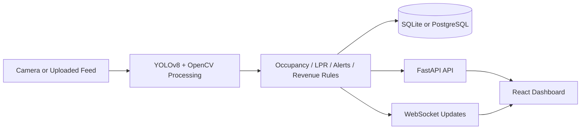
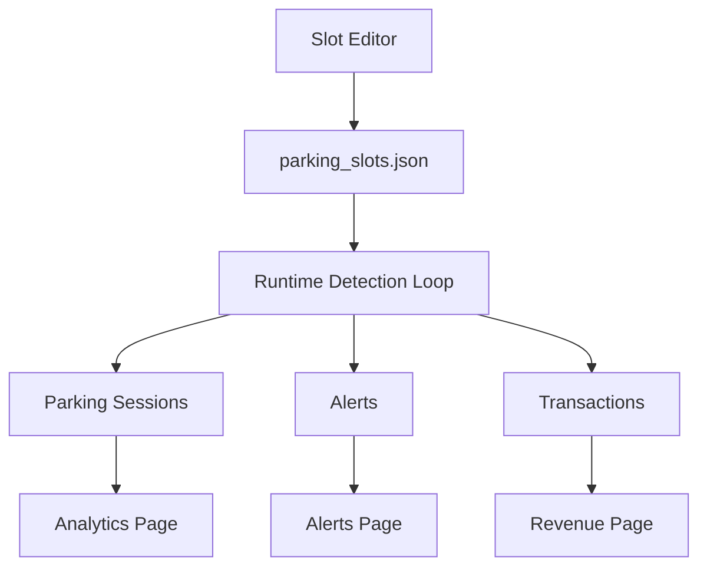

# Smart Parking

Smart Parking is a full-stack parking operations platform built with FastAPI, React, OpenCV, and YOLOv8. It supports live camera feeds and uploaded media, tracks slot occupancy, surfaces operational alerts, estimates revenue, and provides analytics for dwell time and occupancy trends.

This repository is prepared for sharing:

- runtime build artifacts are excluded
- local databases and uploaded media are excluded
- tracked slot-layout files are reset to empty templates
- model weights are not committed

## System Overview





## Core Features

- Real-time occupancy detection from webcam or uploaded image/video
- Live annotated feed with slot, entry, and exit overlays
- Slot editor with zone classification and flow-zone drawing
- Recent sessions, alerts, revenue, and analytics dashboards
- Dwell analytics and occupancy heatmaps linked to recorded system data
- License plate recognition, wrong-way detection, speed alerts, and abandoned-vehicle alerts
- CSV, Excel, and PDF reporting/export support

## Architecture

### Backend

- `backend/main.py`: app startup, video processing loop, WebSocket updates
- `backend/api.py`: REST API, uploads, analytics, revenue, alerts, slot config
- `backend/database.py`: SQLAlchemy models and database bootstrap
- `backend/heatmap.py`: analytics aggregation for occupancy heatmaps
- `backend/reporting.py`: report export helpers

### Frontend

- `frontend/src/components/pages/Dashboard.jsx`: main operations view
- `frontend/src/components/pages/AnalyticsPage.jsx`: heatmap and dwell analytics
- `frontend/src/components/pages/RevenuePage.jsx`: revenue metrics and transactions
- `frontend/src/components/pages/AlertsPage.jsx`: active alerts and status
- `frontend/src/components/pages/SlotEditor.jsx`: slot, entry, and exit configuration
- `frontend/src/lib/api.js`: API and WebSocket URL resolution

## Tech Stack

- Python 3.10+
- FastAPI
- SQLAlchemy
- OpenCV
- Ultralytics YOLOv8
- EasyOCR
- React 18
- Chart.js

## Quick Start

### 1. Install dependencies

```bash
pip install -r requirements.txt
cd frontend
npm install
```

### 2. Start the backend

```bash
python3 run.py
```

Backend default: `http://localhost:8000`

### 3. Start the frontend

```bash
cd frontend
npm start
```

Frontend default: `http://localhost:3000`

## Environment Variables

| Variable | Default | Purpose |
| --- | --- | --- |
| `DATABASE_URL` | `sqlite:///backend/parking_local.db` | Database connection |
| `VIDEO_SOURCE` | `0` | Webcam index or uploaded feed path |
| `YOLO_MODEL_PATH` | `yolov8n.pt` | Model weights path |
| `FRAME_SKIP` | `3` | Process every Nth frame |
| `REACT_APP_API_BASE` | unset | Override API base URL |
| `REACT_APP_WS_BASE` | unset | Override WebSocket base URL |

## Local Development

- The frontend proxies API traffic to `http://localhost:8000`
- The frontend can auto-start the backend in development if port `8000` is not already active
- The analytics page now reads real dwell/session data and zone-aware heatmap data from backend storage

## Docker

```bash
docker compose up --build
```

Services:

- Frontend: `http://localhost:3001`
- Backend: `http://localhost:8000`
- PostgreSQL: `localhost:5432`

## Repository Hygiene

This repo intentionally does not include:

- local database contents
- uploaded videos and snapshots
- compiled frontend build output
- Python cache files
- YOLO weight binaries
- personal slot/editor layouts beyond empty starter templates

If you want to configure your own lot:

1. start the app
2. open the Slot Editor
3. draw parking slots, entry, and exit zones
4. save the configuration locally

## Useful Commands

```bash
# backend
python3 run.py

# frontend
cd frontend && npm start

# production frontend build
cd frontend && npm run build

# root shortcuts
npm run backend
npm run frontend
npm run build
```

## Troubleshooting

### Frontend shows `Proxy error` or `ECONNREFUSED`

The backend is not running on `localhost:8000`.

### Frontend shows `Reconnecting...`

The WebSocket connection is not established. Check the backend process and `REACT_APP_WS_BASE` if you override URLs.

### Analytics looks empty

The page will show empty states until the system records occupancy history and closed parking sessions.
