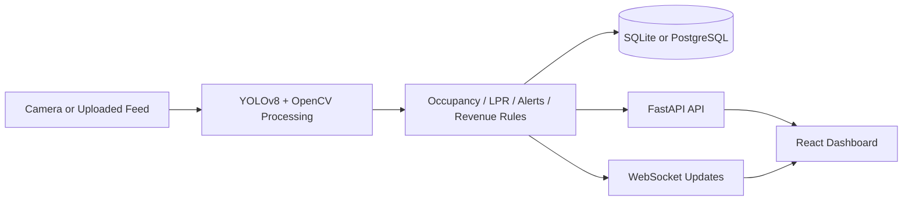
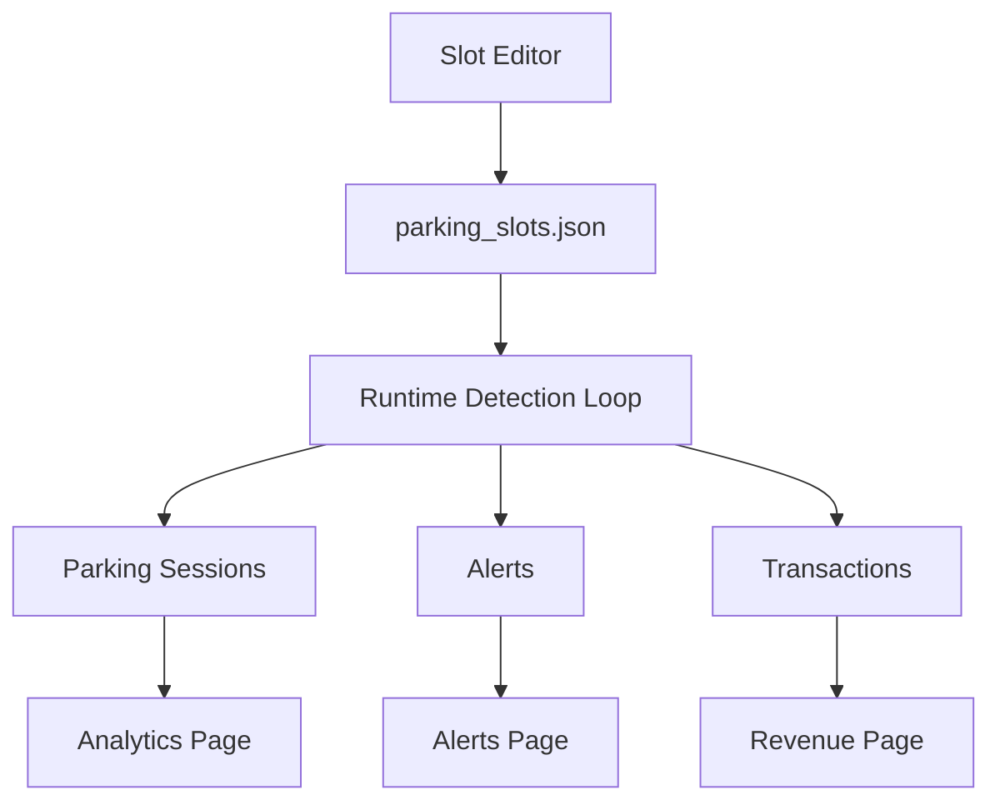

# Smart Parking

Smart Parking is a full-stack parking operations platform built with FastAPI, React, OpenCV, and YOLOv8. It supports live camera feeds and uploaded media, tracks slot occupancy, surfaces operational alerts, estimates revenue, and provides analytics for dwell time and occupancy trends.

This repository is prepared for sharing:

- runtime build artifacts are excluded
- local databases and uploaded media are excluded
- tracked slot-layout files are reset to empty templates
- model weights are not committed

## System Overview





## Core Features

- Real-time occupancy detection from webcam or uploaded image/video
- Live annotated feed with slot, entry, and exit overlays
- Slot editor with zone classification and flow-zone drawing
- Recent sessions, alerts, revenue, and analytics dashboards
- Dwell analytics and occupancy heatmaps linked to recorded system data
- License plate recognition, wrong-way detection, speed alerts, and abandoned-vehicle alerts
- CSV, Excel, and PDF reporting/export support
- Multi-lot management, waitlist queueing, incident reporting, monthly passes, and API integration tokens
- Installable PWA shell with offline caching of the app shell

## Architecture

### Backend

- `backend/main.py`: app startup, video processing loop, WebSocket updates
- `backend/api.py`: REST API, uploads, analytics, revenue, alerts, slot config
- `backend/database.py`: SQLAlchemy models and database bootstrap
- `backend/heatmap.py`: analytics aggregation for occupancy heatmaps
- `backend/reporting.py`: report export helpers

### Frontend

- `frontend/src/components/pages/Dashboard.jsx`: main operations view
- `frontend/src/components/pages/AnalyticsPage.jsx`: heatmap and dwell analytics
- `frontend/src/components/pages/LotsPage.jsx`: multi-lot management
- `frontend/src/components/pages/WaitlistPage.jsx`: queue and promotion workflows
- `frontend/src/components/pages/IncidentsPage.jsx`: incident reporting with image upload
- `frontend/src/components/pages/PassesPage.jsx`: monthly pass billing
- `frontend/src/components/pages/RevenuePage.jsx`: revenue metrics and transactions
- `frontend/src/components/pages/AlertsPage.jsx`: active alerts and status
- `frontend/src/components/pages/SlotEditor.jsx`: slot, entry, and exit configuration
- `frontend/src/lib/api.js`: API and WebSocket URL resolution

## Tech Stack

- Python 3.10+
- FastAPI
- SQLAlchemy
- OpenCV
- Ultralytics YOLOv8
- EasyOCR
- React 18
- Chart.js

## Quick Start

### 1. Install dependencies

```bash
pip install -r requirements.txt
cd frontend
npm install
```

### 2. Start the backend

```bash
python3 run.py
```

Backend default: `http://localhost:8000`

### 3. Start the frontend

```bash
cd frontend
npm start
```

Frontend default: `http://localhost:3000`

### Public Portal Without Localtunnel

Use Cloudflare Tunnel instead of `localtunnel` so visitors do not see the `loca.lt` password reminder page.

1. Start the backend: `python3 run.py`
2. Start the frontend: `cd frontend && npm start`
3. Start the public portal tunnel from the repo root:

```bash
npm run portal:tunnel
```

This command:

- starts a temporary `cloudflared` quick tunnel to `http://127.0.0.1:3000`
- discovers the public `https://<random>.trycloudflare.com` URL
- saves it into `backend/settings.json` as `access_portal_url`

The saved portal URL will include `?portal=access` so the QR/settings page points directly at the public access portal.

## Environment Variables

| Variable | Default | Purpose |
| --- | --- | --- |
| `DATABASE_URL` | `sqlite:///backend/parking_local.db` | Database connection |
| `VIDEO_SOURCE` | `0` | Webcam index or uploaded feed path |
| `YOLO_MODEL_PATH` | `yolov8n.pt` | Model weights path |
| `FRAME_SKIP` | `3` | Process every Nth frame |
| `REACT_APP_API_BASE` | unset | Override API base URL |
| `REACT_APP_WS_BASE` | unset | Override WebSocket base URL |
| `STRIPE_SECRET_KEY` | unset | Stripe server secret key |
| `STRIPE_PUBLISHABLE_KEY` | unset | Stripe publishable key |
| `STRIPE_WEBHOOK_SECRET` | unset | Stripe webhook signing secret |
| `FRONTEND_BASE_URL` | unset | Override checkout success/cancel return URL base |

## Local Development

- `frontend/npm start` now injects `REACT_APP_API_BASE=http://127.0.0.1:8000` and `REACT_APP_WS_BASE=ws://127.0.0.1:8000`
- The frontend can auto-start the backend in development if port `8000` is not already active
- The analytics page now reads real dwell/session data and zone-aware heatmap data from backend storage
- Reservations support one-time Stripe Checkout payments with `Alipay` enabled
- Monthly passes use Stripe subscription checkout with `card` billing

## Payments

- Reservation checkout endpoint: `POST /payments/reservations/{id}/checkout`
- Stripe webhook endpoint: `POST /webhooks/stripe`
- Monthly pass checkout endpoint: `POST /monthly-passes/checkout`
- Billing portal endpoint: `POST /payments/billing-portal`

Important:

- Alipay is used for one-time reservation payments
- Monthly passes use recurring card billing, not Alipay subscriptions

## Additional Modules

- `GET/POST /lots` and `PUT /lots/{id}` for lot management
- `GET/POST /waitlist` plus promote/cancel actions
- `GET/POST /incidents` with `POST /incidents/upload`
- `GET /analytics/forecast` for projected occupancy
- `GET/POST /integrations/tokens` and `GET /integrations/parking/summary`

## Docker

```bash
docker compose up --build
```

Services:

- Frontend: `http://localhost:3001`
- Backend: `http://localhost:8000`
- PostgreSQL: `localhost:5432`

## Repository Hygiene

This repo intentionally does not include:

- local database contents
- uploaded videos and snapshots
- compiled frontend build output
- Python cache files
- YOLO weight binaries
- personal slot/editor layouts beyond empty starter templates

If you want to configure your own lot:

1. start the app
2. open the Slot Editor
3. draw parking slots, entry, and exit zones
4. save the configuration locally

## Useful Commands

```bash
# backend
python3 run.py

# frontend
cd frontend && npm start

# production frontend build
cd frontend && npm run build

# root shortcuts
npm run backend
npm run frontend
npm run build
```

## Troubleshooting

### Frontend shows `Proxy error` or `ECONNREFUSED`

The frontend now talks directly to `127.0.0.1:8000` in development, so this usually means the backend failed to start. Run:

```bash
python3 run.py
```

If you use custom ports, set:

```bash
REACT_APP_API_BASE=http://127.0.0.1:8000
REACT_APP_WS_BASE=ws://127.0.0.1:8000
```

### Frontend shows `Reconnecting...`

The WebSocket endpoint is not reachable. Check that the backend is running and that `REACT_APP_WS_BASE` matches the backend host and port.

### Analytics looks empty

The page will show empty states until the system records occupancy history and closed parking sessions.
